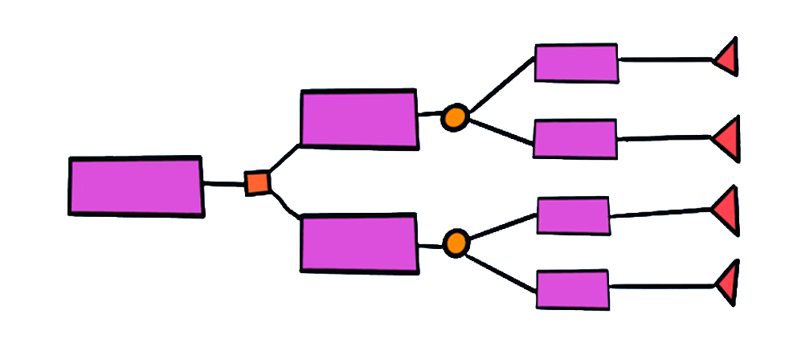

# COVID-19 Outcome Prediction

 

## Problem Overview

The goal of this project is to predict the outcome (recovery or death) for individuals infected with COVID-19. The prediction is based on a set of pre-defined symptoms and demographic factors, using time-series data provided by the World Health Organization (WHO). 

Given the ongoing global pandemic, early detection of the likely outcome can help healthcare professionals prioritize resources and patient care. 

The dataset includes information from January 22, 2020, and provides features such as:
- **Country & Location**
- **Age Group**
- **Gender**
- **Symptoms**
- **History of Visit to Wuhan**

You are tasked with developing classifiers that can accurately predict the outcome for new hospital admissions.

---

## Models & Approach

### 1. **K-Nearest Neighbors (KNN)**

 

  

[K-Nearest Neighbors (KNN)](https://en.wikipedia.org/wiki/K-nearest_neighbors_algorithm):  
KNN is a simple, instance-based learning algorithm. It predicts the class of a new sample based on the majority class among its nearest neighbors in the feature space.

### 2. **Logistic Regression**

 

  

[Logistic Regression](https://en.wikipedia.org/wiki/Logistic_regression):  
Logistic regression is a statistical model that predicts the probability of a binary outcome, using a linear combination of input features.

### 3. **Naïve Bayes**

 

  

[Naïve Bayes](https://en.wikipedia.org/wiki/Naive_Bayes_classifier):  
A probabilistic classifier based on applying Bayes' theorem, assuming independence between features. It's particularly effective for text classification but can be applied to other types of data as well.

### 4. **Decision Trees**

 

  

[Decision Trees](https://en.wikipedia.org/wiki/Decision_tree_learning):  
A decision tree is a flowchart-like tree structure used for classification. It splits the data based on feature values to make predictions. It's interpretable and simple to understand.

### 5. **Support Vector Machines (SVM)**

 

  

[Support Vector Machines](https://en.wikipedia.org/wiki/Support_vector_machine):  
SVM is a powerful classifier that works by finding the hyperplane that best separates data into different classes. It is effective in high-dimensional spaces.

---

## Project Execution

The project consists of several phases:
1. **Data Preprocessing:** The dataset has already been cleaned and preprocessed.
2. **Model Training:** The data is split into training, validation, and test sets. Each model is trained and evaluated.
3. **Hyperparameter Tuning:** For each model, we will tune the hyperparameters to maximize performance.
4. **Model Comparison:** We compare the models based on precision, recall, F1-score, and ROC/AUC curves.

### Key Metrics
- **Precision:** How many predicted positives are actually positive.
- **Recall:** How many actual positives are correctly predicted.
- **F1-Score:** A balanced measure of precision and recall.
- **ROC/AUC:** Measures the model’s ability to distinguish between classes.

---

## Results

At the end of the project, we will have a performance comparison across all models, helping to identify the best-performing classifier for COVID-19 outcome prediction. The model will be chosen based on the highest combined performance across multiple metrics.

---

## Acknowledgments
- World Health Organization (WHO) for the dataset.
- Contributors to the various machine learning algorithms and techniques.

---